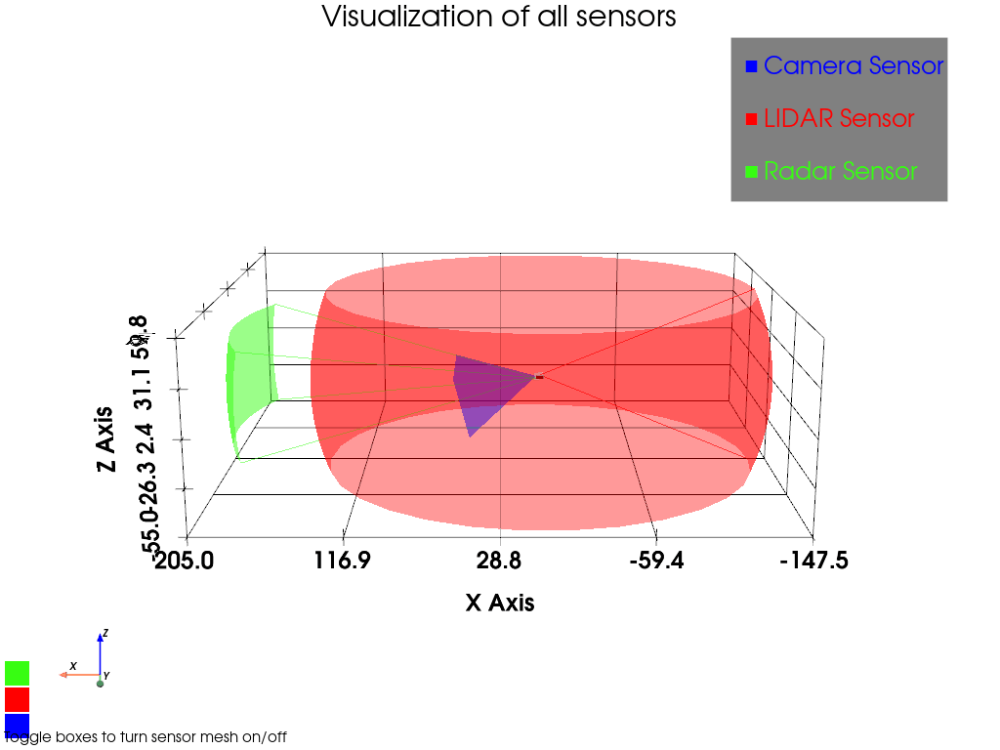
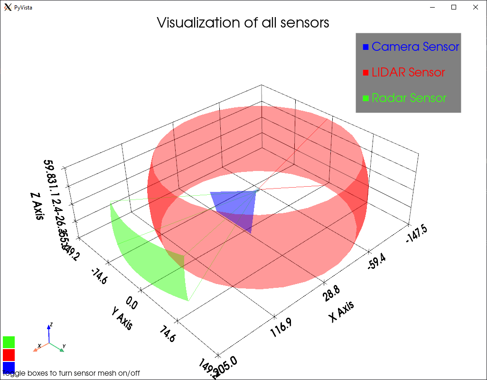
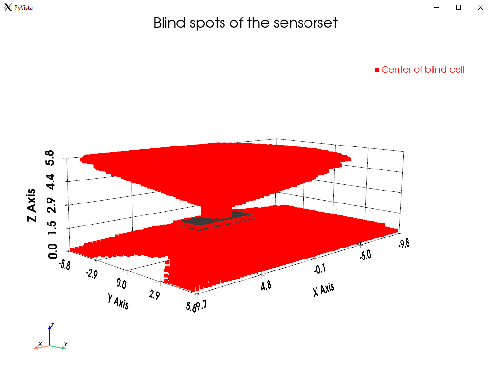
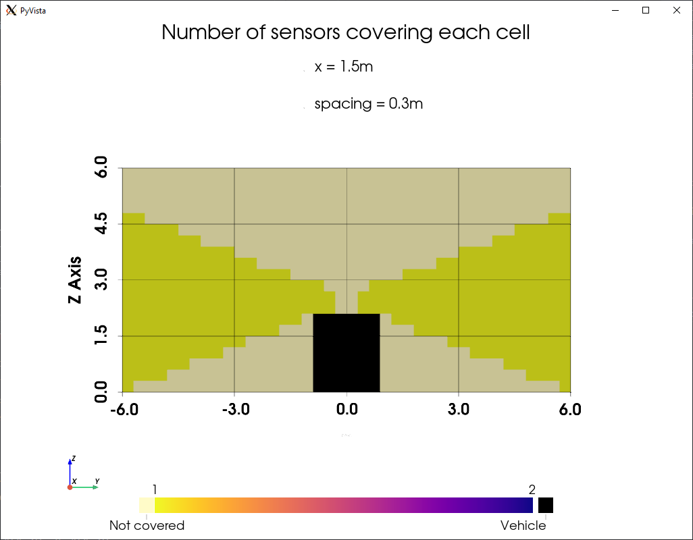
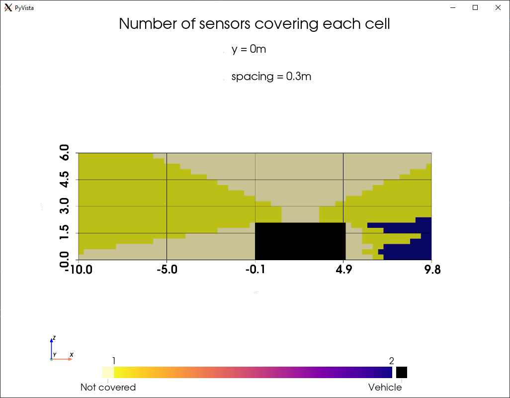
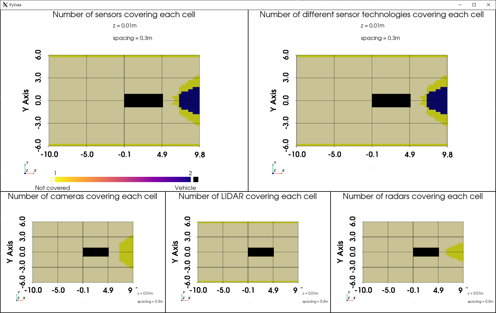
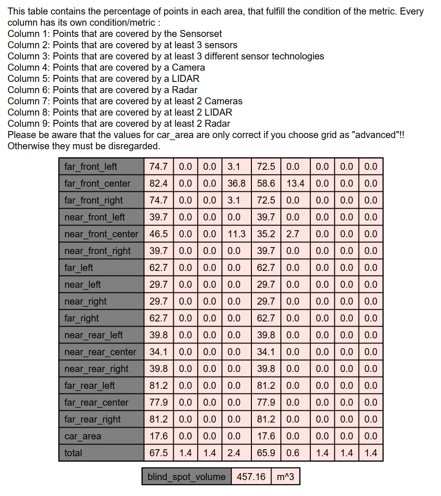

# AV Sensor Setup Coverage



In the initial stages of autonomous vehicle development, defining an optimal sensor setup is crucial. The placement, type, and configuration of sensors play an essential role in ensuring the vehicle's ability to perceive its environment accurately.
This repository provides a comprehensive set of tools designed to assist developers in:

- Coverage Analysis: Evaluate the extent to which sensors can perceive their surroundings.
- Redundancy Assessment: Determine areas where multiple sensors provide overlapping coverage.
- Occlusion Detection: Identify potential blind spots or areas around the vehicle.

## Getting Started
These instructions will get you a copy of the project up and running on your local machine for development and testing purposes. 
 
### Project Structure
The repository contains different packages related to code execution:

```
AVSensorCoverage
├─ run.py               // Main runnable file
├─ config.yaml          // Configuration of the environment, discretization and dimensions
├─ args.py              // Argparser
├─ requirements.txt     // Pip package requirements
├─ environment          // Package for the environment
│  ├─ grid.py
│  ├─ grid_helpers.py
│  ├─ slice.py
│  └─ vehicles.py
├─ plotting             // Package for plotting and report creation
│  ├─ plots.py
│  ├─ plot_helpers.py
│  └─ report.py
├─ sensors              // Package for sensor classes
│  ├─ camera.py
│  ├─ lidar.py
│  ├─ radar.py
│  ├─ sensor.py
│  └─ sensor_helpers.py
├─ sensorsets           // Folder for saving sensor setup definitions
│  ├─ edgar.yaml
│  └─ test_setup.yaml
├─ utils                // Package containing GUI
│  └─ gui.py
└─ vehicle              // Folder for 3D vehicle models
   ├─ simple_box.obj
   └─ t7_reduced.obj
```

### Prerequisites
You need to have the following packages installed on your machine:

    * python3 
    * python3-tk
 
### Installing
The requirements for the python environment can be installed with
```sh
pip install -r requirements.txt
```

 
## Running the Model/Code
You can start running the analysis with the default arguments 
```sh
python3 run.py
```
This will use a simple box vehicle model, stored in `vehicle/simple_box.obj` with a sensor setup defined in `sensorset/test_setup.yaml` and the standard parameters for evaluation defined in `config.yaml`

### Arguments

If you want to use your own vehicle model and sensor setup, you can do so by running the script with
```sh
python3 run.py --sensors <path_to_your_sensor_setup_yaml_file> --vehicle <path_to_your_3d_vehicle_model> --config <path_to_your_config_yaml_file>
```
The `--config` argument passes a yaml file in which you can configure:
 - The dimension of the environment grid `dim_x`, `dim_y`, `dim_z`
 - The placement of the vehicle in the environment. The vehicles rear center axle will be placed at the `origin` parameter of the environment
 - The discretization of the environment is determined by the length of each grid cell, referred to as `spacing`. Be aware that this parameter can significantly affect computational performance. As spacing decreases, the total number of grid cells in a three-dimensional environment increases exponentially,
 - The `nearfield_dist` is the radial distance from the vehicle that is considered to be part of the near-field. The rest of the environment area is regarded as far-field.
 - The `conditions` dictionary inside the `config.yaml` is used for the later generation of reports and plots and describes the following boundaries
   - N1: coverage with at least `N1` sensors
   - N2: coverage with at least `N2` sensors types (radar, camera, lidar)
   - N6: coverage with at least `N6` cameras
   - N7: coverage with at least `N7` lidar
   - N8: coverage with at least `N8` radar
 - The `slice` dictionary inside `config.yaml` is used to define the different slices that are produced in the report. You can adjust the `number` and `distance` values to create multiple slices with z-normal at different heights, starting from $z = 0$

Further argument options for the programm execution are:
- ``--gui_mode`` if this option is set, you can manually configure the input parameters with a gui
- ``--no_plots`` if this option is set, no plot windows are generated
- ``--create_report`` if this option is set, a detailed pdf-report will be generated
- ``--save_variables`` if this option is set, the simulation variables will be saved
- ``--path`` parent directory of the simulation results. Default is in `cwd/simulation_results`
- ``--name`` specific folder name of the simulation results, defaults to `simulation_<current_datetime>`

# Expected Output
The standard output are five consecutive plot windows.
1. Visualization of the FoV of all sensors. The visibility of each single sensor can be toggled with the checkboxes on the left.
2. Visualization of the blind spot cells around the vehicle. All red points represent the center of grid cells that are not covered by any sensor. 
3. The visualization of the number of sensors covering a cell in the rear view of the vehicle 
4. The visualization of the number of sensors covering a cell in the side view of the vehicle 
5. Different plots regarding the number of sensors and sensor modalities covering each area. 

If the `--create_report` option is set, an addtional report `Results.pdf` is created in the directory specified by `--path` and `--name`. This gives detailed information about the coverage of each sensor and the whole sensor setup in the different areas around the vehicle.



## Authors
Philipp Hafemann, philipp.hafemann@tum.de, Institute of Automotive Technology, School of Engineering and Design, Technical University of Munich, 85748 Garching, Germany

Simon Hahn, simon.hahn@tum.de, Institute of Automotive Technology, School of Engineering and Design, Technical University of Munich, 85748 Garching, Germany


## License
This project is licensed under the GNU LESSER GENERAL PUBLIC LICENSE - see the `LICENSE` file for details
